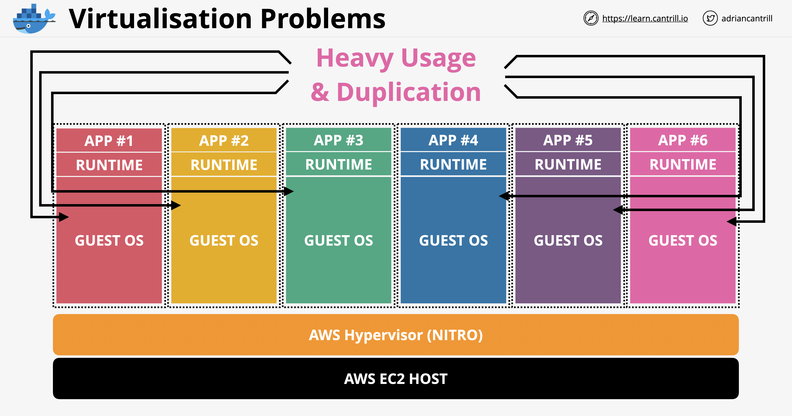
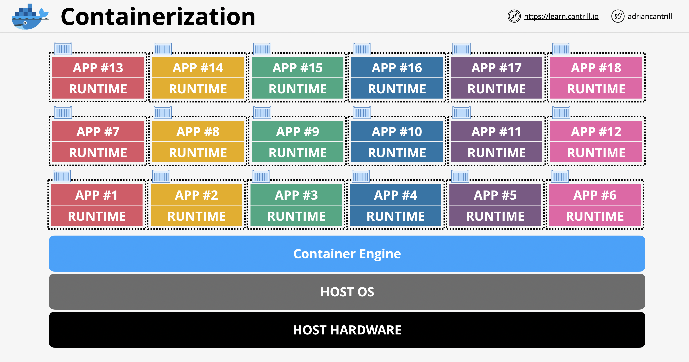

# Containers & ECS

## Introduction to Containers

### Virtualization Problems

Each VM use a Guest OS and OS can consume 60% of space ram

most of the OS are the same / duplication and wasting system ressources

Every stop / start need manipulate the OS

Do we need all these 6 Operating system

### Containerization

Container is a process on the host OS

Docker is a container Engine

Can run container (seen as single process in the operating system)

- Inside this process (isolated file system / process)
- Librairies and dependencies

Much lighter because you don't need to run as many OS as container

### Image Anatomy

Docker Image from a docker file

each steps create a fs layers

- base image : FROM centos (ultra lightweight of centos base )
- software : RUN yum install httpd
- ADD : run-httpd.sh (script)
- docker image as a layer of R/W to store the changes

### Container Registry

Docker file to create Container Image and Host it in Container Registry (docker hub)

### Key concepts

Docker files are used to build images

Portable - self contained, always run as expected (never not on my machine)

Lightweight - Parent OS used, fs layers are shared

Container only runs the application & environment it needs

Provides much of the isolation VM's do

## Elastic Container Service

### Concepts

Service or Task deploy to an ECS cluster

**Container Definition** - Image & Ports

**Task definition** - Security (Task Role), Container(s), Resources (RAM / CPU)

**Task Role** - IAM Role which the TASK assumes

**Service** - How many copies of task, HA, restarts

### Cluster Mode

ECS - EC2 Mode

- ECS cluster created in a VPC with an ASG (Auto Scaling Group)
- on multiple AZ in a VPC
- you need to manage all container hosts

ECS - Fargate Mode

- Managed service
- Shared Infrastructure

### EC2 vs EVS (EC2) vs Fargate

if you use containers ... use ECS

EC2 Mode : 

- large workload - price conscious
- ready to manage EC2 overhead
- you will pay for EC2 instance event when not used

Fargate : 

- large workload - overhead conscious (management overhead)
- Small / burst workloads
- batch / periodic

