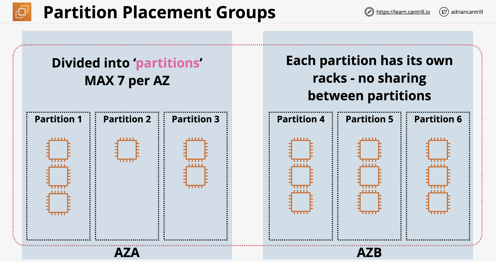

# EC2 Advanced    

## Bootstrapping EC2 using User Data

http://169.254.169.254/latest/user-data

User Data accessed via the meta-data IP

executed by the instance OS only at Launch

it's opaque to EC2, just a block of data

Not Secure : don't use it for passwords or long term credentials

16KB limit

Can be modified when instance stopped

## Enhanced Bootstrapping with CFN-INIT

AWS::Cloudformation::Init

Works with stack updates (not only on boot)

Template -> Stack -> Instance

cfn-init : user-data (packages, groups, users, sources, files, commands, conditions)

cfn-signal : test if cfn-init is ok and return state

## EC2 Instance Roles & Profile

Credentials are inside meta-data

iam/security-credentials/role-name

Automatically rotated - Always valid

Should always use IAM Role rather than adding access keys into instance

CLI tools will use ROLE credentials automatically

## AWS Systems Manager Parameter Store

Store configuration & secrets

licenses, db strings, full configurations, passwords

plaintext or cyphertext

hierarchy & versioning

## System and Application Logging on EC2

Cloudwatch is for metrics, 

Cloudwatch Logs is for logging

Cloud watch Agent is required (+ configuration and permissions)

- Create an IAM Role to capture logs in CloudWatch logs from CloudWatch Agent in EC2 instance
- log string (/var/log/secure) in log groups

## EC2 Placement Groups

### Cluster : close together

all members have direct connections to each other

Same Rack / sometimes same time

ONE AZ ONLY

Can span VPC peers but impacts performance

Requires a supported instance type

Use the same type of instance

Launch at the same time

10 Gbit/s single stream  (usualy 5)

Use cases : Perf, fast speeds, low latency

### Spread : keep instances separated

Highest level of availability - each instance runs from a different rack

7 instances per AZ (HARD Limit)

Not supported for Dedicated Instances or Hosts

Use case : Small number of critical instances that need to be kept separated from each other

### Partition : separated fault domain

7 Partitions per AZ

Instances can be placed in a specific partition or auto placed

Partition placement groups are not supported for Dedicated Host

Great for HDFS, HBase, and Cassandra

## Dedicated Host

You pay for the host (sockets & cores), no instance charge

- dedicated to you

On demand & Reserved options

### Limitations

AMI Limits - RHEL, Suse Linux, and Windows AMIs aren't supported

Placement groups are not supported

Amazon RDS instances not supported

Hosts can be shared with other organization account

## Enhanced Networking & EBS Optimized

Enhanced Networking = SR-IOV

- Physical NIC present logical NIC card to each instance

Enhanced EBS = dedicated capacity

- most instaces support and have enabled by defaut